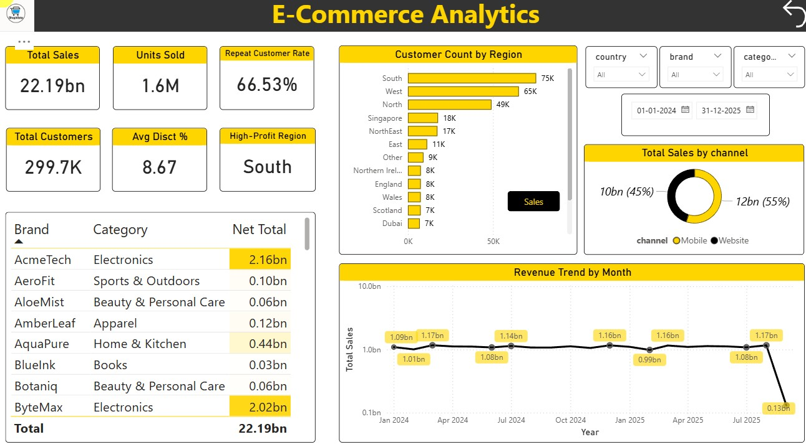

# 🛒🛍️ **Ecommerce_data_pipiline_using_spark_and_databricks**
An end-to-end data engineering project using Apache Spark, Databricks, Azure ADLS, and Power BI. This includes transforming raw CSV data through bronze, silver, and gold layers, culminating in a Power BI dashboard for business insights.

---

## 🚨 **Problem Statement**

ShopVista is a fast growing ecommerce company, while the business is growing fast the executive team here is having struggle in terms of getting the overall insights
on the state of the business. This is happening because they don't have a central Data Engineering practice in place. Their teams are working in silo's and they have scattered data in databases and files. Whenever operation team wants to get insights, they have to talk to multiple teams to get the data and they will join them together manually. To overcome this problem the organization management decided to onboard data engineering practice and they have started this particular project.

---

## 🎯 **Objectives**

- Automate ingestion of e-commerce data (orders, returns, shipments, dimensions)  
- Standardize and clean data for consistency across all layers
- Scheduled jobs to trigger the execution of Data pipelines at regular intervals  
- Build an analytics-ready data model integrated with **Power BI**  
- Enable scalable and auditable governance with **Unity Catalog**

---

## 🛠️ **Tools & Technologies**

| **Layer**       | **Tool / Service**                | **Purpose**                                      |
|-----------------|-----------------------------------|-------------------------------------------------|
| **Ingestion**   | Databricks Autoloader (Structured Streaming) | Incremental data loading from ADLS               |
| **Storage**     | Azure Data Lake Storage (ADLS Gen2) | Centralized data repository                      |
| **Processing**  | Azure Databricks (PySpark)    | ETL and transformation                           |
| **Governance**  | Unity Catalog                | Centralized access control and schema registry  |
| **Visualization** | Power BI                      | BI dashboards and reports                        |

---

## 📝 **Technical Architecture**


The above diagram represents the technical architecture of our project. Here We have our company's database which is a OLTP system. It stores the company's day to day transactions. From this OLTP system through a scheduled job the data will be dropped into our Azure data lake(ADLS) as CSV Files. Then we will connect the ADLS data lake to databricks through Azure access connector. Inside Databricks we will use Medallion architecture which have Bronze, Silver and Gold layers, in Bronze layer we will have raw data, in Silver layer we will do data cleansing and transformations, in Gold layer we will generate new columns for better insights and in Gold Layer we will have our BI ready data. Then we will attach Data Visualization tool PowerBI to visualize and generate insights.

## 🗂 **Folder Structure** (ADLS Container: `ecomm-raw-data`)

The folder structure within the **ADLS container** is organized by entity (table).  
**Fact tables** contain a **`landing/`** subfolder for incoming data files.

```plaintext
ecomm-raw-data/
│
├── brands/                # Product brands data
├── category/              # Product category data
├── customers/             # Customer demographic data
├── date/                  # Date dimension table
├── products/              # Product details data
│
├── order_items/           # Sales transactions (item-level data)
│   └── landing/           # ← Daily data landing zone for new items
│
├── order_shipments/       # Shipping details for orders
│   └── landing/           # ← Monthly data landing zone for shipments
│
├── order_returns/         # Product return data
│   └── landing/           # ← Monthly data landing zone for returns
│
└── checkpoint/            # ← Used by Databricks Autoloader for streaming
```

---

### 📌 **Data Frequency**

- **order_items** → Daily data ingestion  
- **order_shipments** & **order_returns** → Monthly data ingestion  

---

## ⚙️ **ETL Workflow Overview**

| **Layer**   | **Description**                                                                 |
|-------------|---------------------------------------------------------------------------------|
| **Bronze**  | Raw ingestion using **Autoloader** into Delta tables with minimal transformation. |
| **Silver**  | Cleansed and schema-validated data. Reads directly from **Bronze** tables using **Unity Catalog**. |
| **Gold**    | Aggregated analytical tables for **Power BI** consumption.                       |

---

## 📊 **Power BI Reporting Layer**

Power BI connects to the **Gold layer** tables via **Databricks SQL Warehouse** for visual insights.



---

## ✅ **Outcomes**

- ⏱️ Automated daily & monthly ingestion using Autoloader 
- 🧩 Unified and governed schemas via Unity Catalog  
- ⚙️ Simplified data transformations (PySpark & Delta)  
- 📊 Real-time insights in Power BI 
- 🚀 Scalable architecture  
